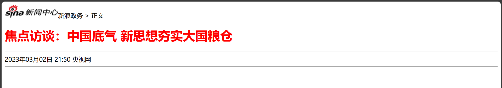
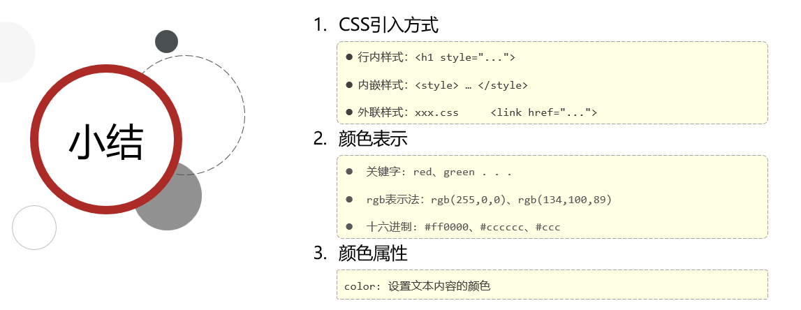

> 第二周任务

> 

# 概述


## 学习目标

### 以往模式

> 

> 

### 当今模式


- 需要有Java基础

### 能力需求


## Web开发


- World Wide Web


- 登录网站运行在服务器上， 用户通过远程访问


- 前端程序只有框架，需要从数据库获取数据填充到框架中


- 前后端分离开发，前后端程序不在同一服务器上，当今主流开发模式


- 混合开发，前后端程序都在后端服务器上运行，以往的开发模式


- 重点后端，前端程序可能在多端运行，都用一套Java程序

## 前端部分

### 流程安排


### 前端简介


- W3C 万维网联盟
- HTML为框架结构，CSS为表现布局，JS为行为交互


- 仅HTML


- HTML+CSS


- HTML+CSS+JS，产生动画，点击会切换图片


### VSCode开发工具

#### 安装


- 安装过程略

#### 插件


- 所要安装的插件


#### 配置

- 配置过程略

#### 快捷键


- ! ：生成html、head、body框架

<br/>

- alt+B ：在浏览器中运行html文件

#### 注意事项


# HTML+CSS

## 简介


- 超文本：不仅包含文本内容，还可以包含图片、音频、视频
- 标记语言：由标签构成，不同标签代表不同内容


- 控制产生不同样式


### W3school前端教程

[https://www.w3school.com.cn/](https://)


- 点击HTML教程中的一项后，选择参考书可以按字母排序快速找到所要查看的教程

## HTML快速入门


- head表示标题部分
- body表示主体部分


- 标题部分为标签页内容

```html
<html>

<head>
    <title>HTML快速入门</title>
</head>

<body>
    <h1>Hello HTML</h1>
    
</body>

</html>
```


- 标签中本身不区分大小写，如<HTmL>
- 图片地址（标签属性值）可以加双引号也可以加单引号
- 语法松散，比如</html>可以去掉


## 基础标签&样式


### 标题排版（图片、标题、水平线）


- url：统一资源定位符/链接/地址
- h1一级标题，h6六级标题，从大到小，没有h7
- <hr>为水平分割线

```html
<!-- 文档类型为html -->
<!DOCTYPE html>
<!-- 语言为中文 -->
<html lang="en">

<head>
    <!-- 字符集为UTF-8 -->
    <meta charset="UTF-8">
    <!-- 设置浏览器兼容性 -->
    <meta name="viewport" content="width=device-width, initial-scale=1.0">

    <title>Document</title>
</head>

<body>

</body>

</html>
```

- 输入! 可自动生成html，head，body框架
- IDEA插件可以使用IDEA快捷键，ctrl+shift+/：注释，ctrl+alt+L：代码对齐

#### 图片

```html
<body>
    <!-- 
    img标签：
        src：图片资源路径
        width：宽度(px:像素m, %:相对于父元素的百分比)
        height：高度(px:像素m, %:相对于父元素的百分比)
    路径书写方式：
        绝对路径：
            1.绝对磁盘路径：D:\Code\HTML\JavaWeb_Heima\新浪新闻\img\news_logo.png
                
            2.绝对网络路径：https://i2.sinaimg.cn/dy/deco/2012/0613/yocc20120613img01/news_logo.png
                
        相对路径：./img\news_logo.png ../新浪新闻/img/news_logo.png
            
            
            
    -->
    新浪政务 > 正文
</body>
```

- 输入img可以自动生成

- 可以直接在后面写上 图片后面对应的文字

##### 宽度和高度

- img标签：src：图片资源路径     width：宽度     height：高度
- 宽度与高度：px:像素, %:相对于父元素的百分比，本例中父元素为<body>，像素与分辨率有关，如分辨率为1920*1080，1920、1080为宽、高像素点个数
- 宽度与高度都是百分比时，只根据width的百分比修改，不会变形只修改比例
- 宽度与高度只修改其中一个时，另一个会随其等比例变化，不会使图片变形，一般为了不变形只修改一个

```html

```

##### 路径

- 绝对路径：绝对磁盘路径（在磁盘中的完整路径），绝对网络路径（在网上的链接）
- 相对路径：./ （当前目录，可省略），../（上一级目录，不可省略）


- 网络路径为图片地址

##### 在浏览器中运行html文件


- 在html文件中右键选择Open in Default Browser，或使用快捷键 alt+B ，可以在浏览器中打开html文件


- 浏览器中右键检查选择元素可以查看元素代码所在行，以及元素的类型与基本信息
- 比如该图中img图像的像素大小为142.42*100，因为高度定义的是100px，宽度是<body>的20%，即网页宽度的20%

###### 成果

```html
<!-- 文档类型为html -->
<!DOCTYPE html>
<!-- 语言为中文 -->
<html lang="en">

<head>
    <!-- 字符集为UTF-8 -->
    <meta charset="UTF-8">
    <!-- 设置浏览器兼容性 -->
    <meta name="viewport" content="width=device-width, initial-scale=1.0">

    <title>焦点访谈：中国底气 新思想夯实大国粮仓</title>
</head>

<body>
    <!-- 
    img标签：
        src：图片资源路径
        width：宽度(px:像素m, %:相对于父元素的百分比)
        height：高度(px:像素m, %:相对于父元素的百分比)
    路径书写方式：
        绝对路径：
            1.绝对磁盘路径：D:\Code\HTML\JavaWeb_Heima\新浪新闻\img\news_logo.png
                
            2.绝对网络路径：https://i2.sinaimg.cn/dy/deco/2012/0613/yocc20120613img01/news_logo.png
                
        相对路径：./img\news_logo.png ../新浪新闻/img/news_logo.png
            
            
            
    -->
    新浪政务 > 正文
</body>

</html>
```


#### 标题与水平分割线

```html
<body>
    <h1>焦点访谈：中国底气 新思想夯实大国粮仓</h1>
    <h6>焦点访谈：中国底气 新思想夯实大国粮仓</h6>

    <hr>
    2023年03月02日 21:50 央视网
    <hr>
    
</body>
```

- 输入h1会直接生成<h1></h1>，h2~h6相同
- 输入hr会直接生成<hr>水平分割线，两个<hr>之间直接输入想在中间插入的文本即可


###### 成果

```html
<!-- 文档类型为html -->
<!DOCTYPE html>
<!-- 语言为中文 -->
<html lang="en">

<head>
    <!-- 字符集为UTF-8 -->
    <meta charset="UTF-8">
    <!-- 设置浏览器兼容性 -->
    <meta name="viewport" content="width=device-width, initial-scale=1.0">

    <title>焦点访谈：中国底气 新思想夯实大国粮仓</title>
</head>

<body>
    <!-- 
    img标签：
        src：图片资源路径
        width：宽度(px:像素m, %:相对于父元素的百分比)
        height：高度(px:像素m, %:相对于父元素的百分比)
    路径书写方式：
        绝对路径：
            1.绝对磁盘路径：D:\Code\HTML\JavaWeb_Heima\新浪新闻\img\news_logo.png
                
            2.绝对网络路径：https://i2.sinaimg.cn/dy/deco/2012/0613/yocc20120613img01/news_logo.png
                
        相对路径：./img\news_logo.png ../新浪新闻/img/news_logo.png
            
            
            
    -->
    新浪政务 > 正文

    <h1>焦点访谈：中国底气 新思想夯实大国粮仓</h1>

    <hr>
    2023年03月02日 21:50 央视网
    <hr>
</body>

</html>
```


## 标题样式

### CSS引入方式


- 行内样式只对一个标签有效，故不推荐

- 内嵌样式写在head标签中
- 外联样式写在单独的.css文件中，使用时需用link标签引入


- 右键文件，选择Duplicate可以复制一份文件出来

```html
<!-- 方式1：行内样式 -->
<h1 style="color: red;">焦点访谈：中国底气 新思想夯实大国粮仓</h1>
```

- 在<body>标签中，只针对于当前单个h1标签的样式

```html
<head>
    <!-- 方式2：内嵌样式 -->
    <style>
        h1 {
            color: red;
        }
    </style>
</head>
```

- 在<style> 标签中的h1称为标签选择器/元素选择器
- 用该方式定义，该文件中的h1标签的样式都会改变
- 一般通用定义在<head>标签中

```css
h1 {
    color: red;
}
```

```html
<head>
    <!-- 方式3：外联样式 -->
    <link rel="stylesheet" href="css\news.css">
</head>

<body>
    <h1>焦点访谈：中国底气 新思想夯实大国粮仓</h1>
</body>
```

- 输入link自动生成<link rel="stylesheet" href="">
- 前一部分代码定义在根目录css文件夹下的news.css文件中

###### 成果

```html
<!DOCTYPE html>
<html lang="en">

<head>
    <meta charset="UTF-8">
    <meta name="viewport" content="width=device-width, initial-scale=1.0">

    <title>焦点访谈：中国底气 新思想夯实大国粮仓</title>

    <!-- 方式2：内嵌样式 -->
    <style>
        h1 {
            color: red;
        }
    </style>

    <!-- 方式3：外联样式 -->
    <!-- <link rel="stylesheet" href="css\news.css"> -->
</head>

<body>
    新浪政务 > 正文

    <!-- 方式1：行内样式 -->
    <!-- <h1 style="color: red;">焦点访谈：中国底气 新思想夯实大国粮仓</h1> -->
    <h1>焦点访谈：中国底气 新思想夯实大国粮仓</h1>


    <hr>
    2023年03月02日 21:50 央视网
    <hr>
</body>

</html>
```



### 颜色表示


- rgb()中的三个元素分别表示红色，黄色，蓝色，数值越大代表颜色越深

- rgb(255,0,0)为红色，rgb(0,0,0)为黑色，rgb(255,255,255)为白色
- 十六进制表示法中，#后面有六位，每两位代表一个颜色，分别为红、黄、蓝，当其中一个颜色的两位相同时，可以用一位来代替

```css
h1 {
    color: red;
}
```

```css
h1 {
    color: rgb(255,0,0);
}
```

```css
h1 {
    color: #f00;
}
```

- 如#f001，#后面为四位时代表rgba()，比rgb更细致的描述


- 在vscode中可以点击所要的颜色自动生成 rgb/# 等各种形式的参数


- 可以在浏览器中用识色器插件识别网页元素的颜色



### 